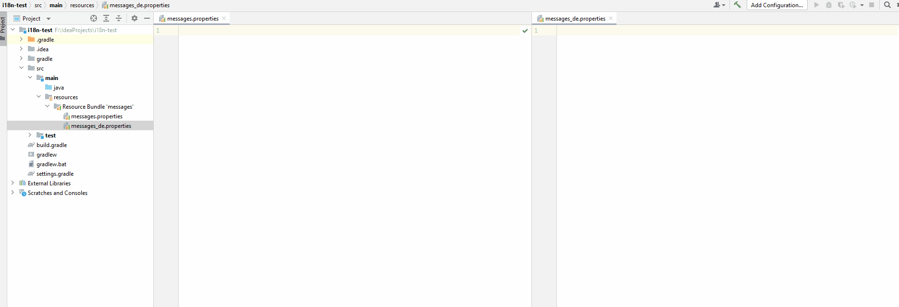

# Localization files auto translator IDEA Plugin

The purpose of the plugin is automatic translation of localization files via the Yandex translator API.

Example:

The main file is considered to be messages.properties with English translation. After editing the file, as a rule, when you switch to another window, the plugin will check for other localization files and bring them to the same form by adding a translation to a specific language.

To use the plugin, you need to activate the checkbox and enter the Yandex Secret Key. 

Instructions for creating a key https://yandex.cloud/ru/docs/iam/operations/api-key/create